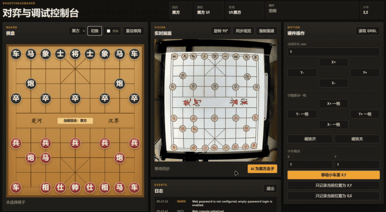
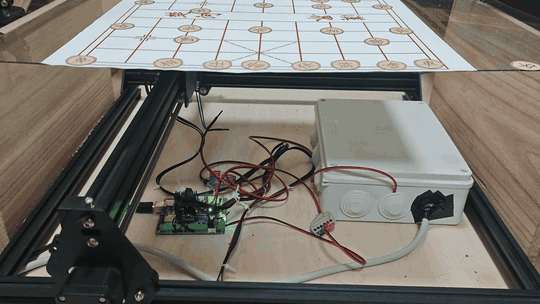
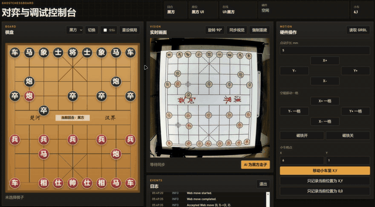

# GhostChessboard

An automated Xiangqi chessboard for human-vs-AI play and demonstrations, built as an **Embedded Systems** course project.

[中文版](README.zh-CN.md)

## Overview

GhostChessboard uses flat Xiangqi pieces that slide directly on the board surface. Each piece is mounted on a magnet-attracting carrier with a piece sticker on top. An electromagnet on an XY gantry under the board drags the pieces automatically, enabling physical human-vs-AI games and automated demos.

## Demos

| Web AI move | Side-view mechanical motion |
|---|---|
|  |  |

| Path planning obstacle avoidance | Capture behavior |
|---|---|
|  |  |

## Documentation

- [Technical plan](docs/tech.md)
- [Bill of materials](docs/bom.md)
- [Project progress](docs/progress.md)
- [Vision integration](docs/vision.md)
- [Web console](docs/web.md)
- [Field network](docs/network.md)
- [GRBL debug notes](docs/grbl.md)
- [Electromagnet validation notes](docs/magnet.md)

## Repository Scope

- This repository owns motion control, board-state intake, and system integration.
- The vision inference pipeline is maintained separately in the sibling repository `../GhostVision`.
- This repository consumes standardized external vision results and can orchestrate the GhostVision CLI. Vision calibration, recognition, and model inference are maintained by `../GhostVision`.
- The web camera preview additionally depends on OpenCV.
- The default development entry point is `python -m src.cli ...`. After installing the command entry point, `ghostchessboard ...` can also be used.

## Web Console

The web console is used for on-site games, hardware debugging, log inspection, and camera preview. Start it on the NUC with:

```bash
GHOSTCHESSBOARD_WEB_PASSWORD=your-password .web-venv/bin/python -m src.cli web --host 0.0.0.0 --port 8080
```

See [`docs/web.md`](docs/web.md) for installation, shutdown, environment variables, and field conventions. See [`docs/network.md`](docs/network.md) for network access.

## Team

| Member | Area |
|---|---|
| [@Victor-Quqi](https://github.com/Victor-Quqi) | Software: vision, AI, and motion control |
| [@AmakusaMika](https://github.com/AmakusaMika) | Demo video and presentation preparation |
