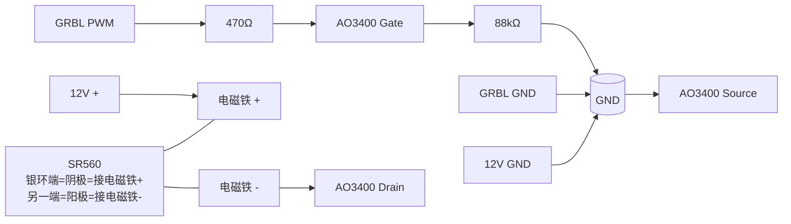

# 电磁铁驱动与磁力验证

## 当前结论

控制板（ESP32 GRBL 六轴）上的“激光接口”**已验证可以输出 `M3/M5` 控制信号，但当前测得的 `PWM` 为约 `0V/5V` 逻辑电平，不是可直接给 12V 电磁铁供电的功率输出**。

因此，现阶段不再采用“电磁铁直接接板载激光接口”的方案，后续改为：

- GRBL 板输出 `PWM` 控制信号
- 外接 N 沟道 MOSFET 作为低边开关驱动电磁铁
- 电磁铁仍由独立 12V 电源供电

早期（2026-03 / 2026-04 初）不同电磁铁型号与板厚组合的详细实测记录见 [`archive/magnet-early-trials.md`](archive/magnet-early-trials.md)。

## 磁路现象

- 吸盘式电磁铁的最大磁力位置是一个环，不是中心单点
- 即使棋片中心与电磁铁中心重合后再通电，棋片也可能被拉向磁力环并小幅偏移
- 较大落点偏差的主因是环状磁力峰值造成的稳定偏置，不是动态跟随滞后
- 当前控制模型按 `magnet_ring_offset = 9mm`、`drag_lag = 6mm` 计算
- `release_offset = magnet_ring_offset + drag_lag = 15mm`

## 自制低边开关

用途：把 GRBL 板激光接口输出的 `0V/5V` PWM 信号转换成对 `12V` 电磁铁的实际通断控制。

用料：

- `AO3400`，`1` 个
- SOT-23 转接板，`1` 块
- `470Ω` 电阻，`1` 个
- `88kΩ` 左右下拉电阻，`1` 个
- `SR560`，`1` 个
- 导线若干
- 可选：`100~470uF` 电解电容，`1` 个

接线图：



接线说明：

- `Source` 接公共地
- `Drain` 接电磁铁负极
- 电磁铁正极直接接 `+12V`
- `PWM` 通过 `470Ω` 接 `Gate`
- `Gate` 通过 `88kΩ` 下拉到 `GND`
- `GRBL GND` 和 `12V GND` 必须共地
- `SR560` 反并在线圈两端，银环端为阴极，接电磁铁正极；另一端为阳极，接电磁铁负极

制作步骤：

1. 确认 `AO3400` 的 `G / D / S` 引脚定义。
2. 把 `AO3400` 焊到转接板上。
3. 焊 `470Ω` 电阻：一端接 `PWM` 输入，一端接 `Gate`。
4. 焊 `88kΩ` 下拉电阻：一端接 `Gate`，一端接 `GND`。
5. `Source` 接公共地。
6. `Drain` 接电磁铁负极。
7. 电磁铁正极直接接 `+12V`。
8. `SR560` 并到电磁铁两端，银环端接 `+12V`，另一端接负极。
9. 如果要加电容，就并在电磁铁附近的 `+12V` 和 `GND` 之间。

上电前检查：

- `12V +` 没有直接短到 `GND`
- 电磁铁负极接的是 `Drain`，不是直接接地
- `Source` 已接公共地
- `PWM` 没有误接到 `+12V`
- 二极管方向正确，银环端接 `+12V`
- `GRBL GND` 和 `12V GND` 已共地

验证步骤：

1. 先只测通断，不放棋子和面板。
2. 控制板通过 USB 连上 NUC。
3. 串口波特率用 `115200`。
4. 检查 `GRBL` 参数：`$30=1000`，`$32=0`。
5. 发送下面这组指令：

```text
$30=1000
$32=0
M3 S1000
?
M3 S500
?
M5
?
```

验证时应看到：

- `M3 S1000` 后，状态显示 `FS:0,1000`
- `M3 S500` 后，状态显示 `FS:0,500`
- `M5` 后，状态回到 `FS:0,0`
- `M3 S1000` 时，`PWM` 对 `GND` 约 `5V`
- `M5` 时，`PWM` 对 `GND` 接近 `0V`
- 电磁铁在 `M3` 时吸合，在 `M5` 时释放

## 2026-04-13 当前工作形态更新

- 当前默认被拖对象已从木质棋子切到直接拖动的扁平棋片：直接使用 `Φ20×0.3mm` 引磁片作为载片，上表面贴棋子贴纸
- 与木质棋子相比，直接拖载片后的整体拖动稳定性明显更好；但释放偏移阶段对前方邻位的误吸更敏感
- 原棋盘背胶撕除后曾尝试直贴铝板，但板面凹凸不平且当前无力矫正；现已回退到 `2mm` 亚克力上面板，并更换备用棋盘纸
- 现行格距更新为 `x=370/9≈41.11mm`、`y=337/8=42.125mm`
- 当前默认控制参数以 [`docs/tech.md`](tech.md) 为准

## 下一步

- 当前默认棋面载体已切到“引磁片直拖 + 棋子贴纸”，后续所有落点、误吸和速度结论都应以该形态为准
- 现行格距 `x=370/9≈41.11mm`、`y=337/8=42.125mm` 已写入控制程序，后续标定与复验应继续沿用该值
- 高密度区域优先通过连续物理路径与终点释放方向规避误吸，不优先全局减小 `release_offset`

