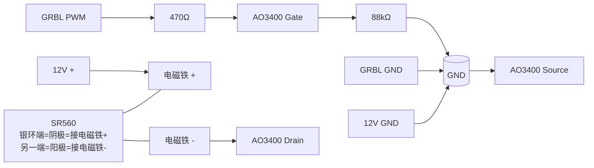

# 电磁铁驱动与磁力验证

## 当前结论

控制板（ESP32 GRBL 六轴）上的“激光接口”**已验证可以输出 `M3/M5` 控制信号，但当前测得的 `PWM` 为约 `0V/5V` 逻辑电平，不是可直接给 12V 电磁铁供电的功率输出**。

因此，现阶段不再采用“电磁铁直接接板载激光接口”的方案，后续改为：

- GRBL 板输出 `PWM` 控制信号
- 外接 N 沟道 MOSFET 作为低边开关驱动电磁铁
- 电磁铁仍由独立 12V 电源供电

## 自制低边开关

用途：把 GRBL 板激光接口输出的 `0V/5V` PWM 信号转换成对 `12V` 电磁铁的实际通断控制。

用料：

- `AO3400`，`1` 个
- SOT-23 转接板，`1` 块
- `470Ω` 电阻，`1` 个
- `88kΩ` 左右下拉电阻，`1` 个
- `SR560`，`1` 个
- 导线若干
- 可选：`100~470uF` 电解电容，`1` 个

接线图：



接线说明：

- `Source` 接公共地
- `Drain` 接电磁铁负极
- 电磁铁正极直接接 `+12V`
- `PWM` 通过 `470Ω` 接 `Gate`
- `Gate` 通过 `88kΩ` 下拉到 `GND`
- `GRBL GND` 和 `12V GND` 必须共地
- `SR560` 反并在线圈两端，银环端为阴极，接电磁铁正极；另一端为阳极，接电磁铁负极

制作步骤：

1. 确认 `AO3400` 的 `G / D / S` 引脚定义。
2. 把 `AO3400` 焊到转接板上。
3. 焊 `470Ω` 电阻：一端接 `PWM` 输入，一端接 `Gate`。
4. 焊 `88kΩ` 下拉电阻：一端接 `Gate`，一端接 `GND`。
5. `Source` 接公共地。
6. `Drain` 接电磁铁负极。
7. 电磁铁正极直接接 `+12V`。
8. `SR560` 并到电磁铁两端，银环端接 `+12V`，另一端接负极。
9. 如果要加电容，就并在电磁铁附近的 `+12V` 和 `GND` 之间。

上电前检查：

- `12V +` 没有直接短到 `GND`
- 电磁铁负极接的是 `Drain`，不是直接接地
- `Source` 已接公共地
- `PWM` 没有误接到 `+12V`
- 二极管方向正确，银环端接 `+12V`
- `GRBL GND` 和 `12V GND` 已共地

验证步骤：

1. 先只测通断，不放棋子和面板。
2. 控制板通过 USB 连上 NUC。
3. 串口波特率用 `115200`。
4. 检查 `GRBL` 参数：`$30=1000`，`$32=0`。
5. 发送下面这组指令：

```text
$30=1000
$32=0
M3 S1000
?
M3 S500
?
M5
?
```

验证时应看到：

- `M3 S1000` 后，状态显示 `FS:0,1000`
- `M3 S500` 后，状态显示 `FS:0,500`
- `M5` 后，状态回到 `FS:0,0`
- `M3 S1000` 时，`PWM` 对 `GND` 约 `5V`
- `M5` 时，`PWM` 对 `GND` 接近 `0V`
- 电磁铁在 `M3` 时吸合，在 `M5` 时释放

## 2026-03-20 实测记录

测试条件：

- 控制板通过 USB 串口接入 NUC
- 串口设备：`/dev/ttyUSB0`
- 波特率：`115200`
- 关键参数：`$30=1000`，`$32=0`

串口指令响应：

- `M3 S1000` 后，GRBL 状态显示 `FS:0,1000` 且 `A:S`
- `M3 S500` 后，GRBL 状态显示 `FS:0,500` 且仍有可感知吸力
- `M5` 后，GRBL 状态恢复为 `FS:0,0`

万用表测量结果：

- `12V` 对 `GND`：始终约 `12V`
- `M3 S1000` 时，`PWM` 对 `GND`：约 `5V`
- `M5` 时，`PWM` 对 `GND`：接近 `0V`

结论：

- `PWM` 为受 `M3/M5` 控制的逻辑输出
- 不能将电磁铁直接接到 `12V/GND` 或 `12V/PWM` 作为最终驱动方案
- 使用 AO3400 外接低边开关后，现有 5W 电磁铁已可被 `M3/M5` 正常驱动

间隙与拖动现象：

- 隔一张普通 A4 纸时仍可吸动棋子，但吸力已明显吃紧
- 单层 2mm 亚克力条件下，当前 5W 电磁铁可勉强吸动棋子
- 两层亚克力叠加后，当前 5W 电磁铁已无法稳定吸动棋子
- 拖动过程中存在明显启动滞后，电磁铁中心移动一段距离后棋子才开始跟随

当时阶段性判断：

- 现有 5W 电磁铁不足以支撑“双层亚克力 + 更大间隙裕量”的方案
- 永磁体锁定方案暂不作为现阶段硬性要求，否则磁力裕量更差
- 下一步优先更换更强电磁铁继续验证，而不是继续优化当前 5W 型号

## 2026-03-25 新 8W 电磁铁实测记录

测试对象：

- 商品页标称 `12V / 8W / 40kg` 吸盘式电磁铁

电气表现：

- `M3 S1000` 时，`PWM` 对 `GND`：约 `5.00V`
- 电磁铁两端：约 `11.32V`
- 连续通电 `2~3` 分钟后，电磁铁本体温温热
- AO3400 无明显发热

拖动现象：

- 与原 5W 吸盘式电磁铁相比，静态吸力体感无明显跃升
- 双层板条件下，基本仍无有效响应
- 单层板条件下，拖动稳定性可能略有提升，但不是数量级改善
- 新电磁铁吸合面/吸盘直径更大，棋子在中心位置受到的吸力反而弱于吸合面边缘
- 拖动时棋子会优先吸到吸合面边缘，导致启动滞后呈结构性存在，量级接近吸合面半径

补充试验：

- 将棋子底部引磁片裁小后，隔单层板的拖动能力进一步下降
- 结论：单纯缩小引磁片不能解决滞后问题，反而可能直接损失可用吸力

阶段性判断：

- 新 8W 吸盘式电磁铁已验证可被当前 AO3400 低边开关稳定驱动
- 问题瓶颈已从“驱动是否能打满”转为“吸盘式磁路本身不适合当前拖棋场景”
- V1 不再继续更换更强的同类吸盘式电磁铁
- V1 放弃中间永磁体锁定方案，避免进一步增加间隙与锁定力
- V1 面板改为单层方案，棋盘层放在上表面，下表面允许电磁铁通过低摩擦滑脚轻微受控滑擦，以尽量压缩磁距

## 下一步

- 制作 `3mm` 单层透明板方案，并将现有 PP/PVC 棋盘层贴于上表面
- 在电磁铁最低点增加 PTFE/UHMW/特氟龙鼠标脚贴等低摩擦耗材，验证“受控轻擦”是否会导致明显增阻或丢步
- 在单层面板下继续验证连续拖动、启动滞后与邻格干扰
- 若单层方案仍不足，下一步转向新的磁铁类型或磁路结构，而不是继续追同类吸盘式电磁铁的更高标称吸力
